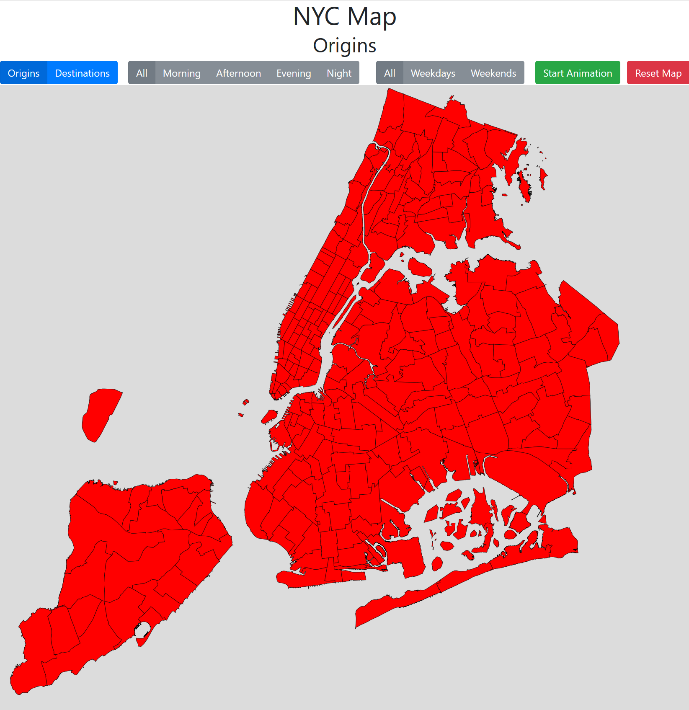
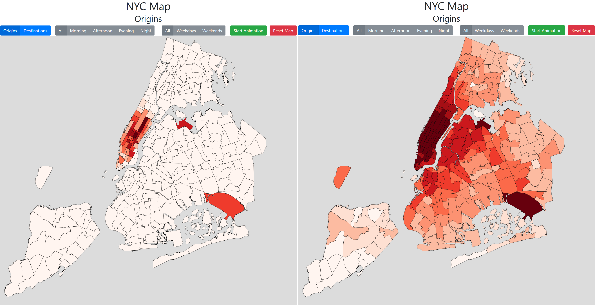
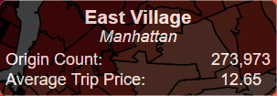
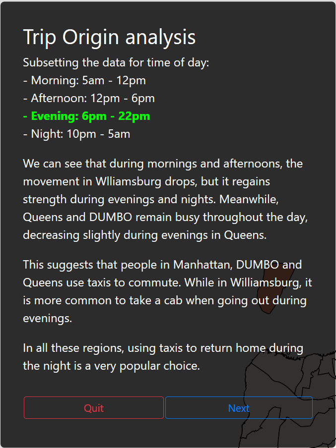
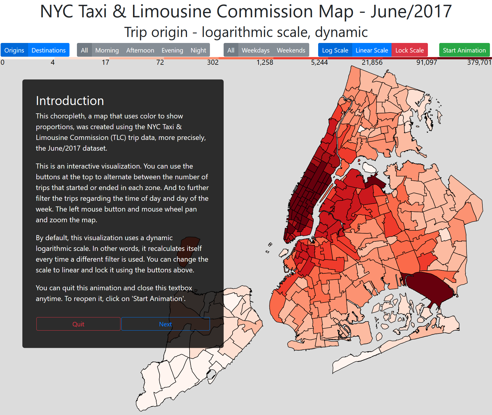

# NYC Taxi & Limousine Commission Trip Data - Interactive Choropleth
by Fernando Maletski

To access the visualization, please click here: http://fmaletski.com/projects/nyc-taxi-map/

## Summary
This interactive data visualization illustrates when and where the NYC yellow taxis pick up and drop off passengers in the city. The data was obtained from the New York City Taxi & Limousine Commission.

By clicking the "Start Animation" button the user is presented with a guided exploration of a few key points:
* Introduction to the visualization
* Busiest parts of the city as the pick up location (origins)
* How time of day affects the map
* How different the map becomes when using destination count to color the map instead of origin count

The objective of the animation is to introduce the user to the modes and filters and inspire them to explore on their own. Because filtering the data using the interactive features, many different observations can be made, such as the busiest parts of the city, when and where New Yorkers like to take cabs, how this preference varies during the day, and the days of the week, and much more.

## Design

Early when thinking about how to visualize this dataset, a choropleth was chosen. Using a map to show the locations and color hues to encode the information is a familiar and effective way to illustrate this dataset.

To create the project, a clean and concise dataset needed to be created, due to limitations to browsers capacity to work with large datasets. This process is the subject of the first part of this section, ETL.

The map design and creation is what the second section is about.

### ETL (Extract, Transform, Load)
The data was downloaded from the NYC TLC website (http://www.nyc.gov/html/tlc/html/about/trip_record_data.shtml). Due to the size of the dataset, I chose to use just the latest yellow taxi file, June 2017 (https://s3.amazonaws.com/nyc-tlc/trip+data/yellow_tripdata_2017-06.csv), but the modules and the visualization html created are able to handle any data from this source with minimal to no modification.

Also, because of the size of the original dataset, I am unable to upload it to github, but it can be easily downloaded using the provided link above.

During prototyping, the location id translation dataset (https://s3.amazonaws.com/nyc-tlc/misc/taxi+_zone_lookup.csv, renamed locid.csv) was used.

The last dataset used is the shapefile (https://s3.amazonaws.com/nyc-tlc/misc/taxi_zones.zip), it was converted to GeoJSON using Gipong's shp2geojson.js (https://github.com/gipong/shp2geojson.js). The original file (taxi_zones.zip) and the resulting (zones.geojson) are included in this repository.

Transforming the dataset to its final form is done in a simple 3 step process. This design decision was made due to the large amount of time needed to complete each step, and compartmentalization of possible bugs.

#### Initial parsing 
Using the module parser.py, each trip is reduced to common attributes, eg. from JFK Airport to Lower East Side, during mornings on weekdays. The resulting trips are counted, and the average price is computed for each combination of attributes.

To speed up the process, parser.py is created in a way that the total amount of combinations is divided into 10 unique lists, so they can be run in parallel without multiprocessing complications, simply using as many terminal windows as a computer can handle. In my case (intel i7-5820k), I ran all 10 processes at the same time, and this stop took about 9 hours to complete.

Here's the list of commands necessary to complete this stage:

```
$ python3 parser.py yellow_tripdata_2017-06.csv 0
$ python3 parser.py yellow_tripdata_2017-06.csv 1
$ python3 parser.py yellow_tripdata_2017-06.csv 2
$ python3 parser.py yellow_tripdata_2017-06.csv 3
$ python3 parser.py yellow_tripdata_2017-06.csv 4
$ python3 parser.py yellow_tripdata_2017-06.csv 5
$ python3 parser.py yellow_tripdata_2017-06.csv 6
$ python3 parser.py yellow_tripdata_2017-06.csv 7
$ python3 parser.py yellow_tripdata_2017-06.csv 8
$ python3 parser.py yellow_tripdata_2017-06.csv 9
```
These commands will create 10 files into the ./data folder: parsed(0-9).csv to be used in the next stage.

#### Merging
The module merger.py uses the 10 previously created files, parsed(0-9).csv, to create a json file (finalData.json) containing all the information necessary to produce the visualization. 

By design, as this visualization uses a fairly large final dataset file, 4 MB+, I chose to include all the arithmetic operations in this part of the project, to reduce drawing times, and smooth the animations.

```
$ python3 merger.py
```

#### Final Dataset

This final stage merges the original zones.json and finalData.json into one single file to be used by the visualization (data.geojson).

I chose to do this because it's simple to use each path element to contain all the data necessary to draw it, no matter what filters are used, not just the format of the zone. This way, it's simple to change the color based on user selection, and show information using tooltips.

```
$ python3 finalDataWriter.py
```

This final command concludes the ETL part of this project.

### Map Design

#### Shapefile to GeoJSON

One surprising difficult step was converting the original NYC TLC shapefile to a format readable by D3.JS. The main problem was not converting the format per se, but the coordinate system.

I first created python module using pyshp to handle the task, it was simple enough, but when I used the resulting file to draw the map, it was nowhere to be found! No amount of translation or D3.JS commands allowed me to find it.

I tried using online tools, like http://mapshaper.org/, to no avail and more advanced programs like QGIS (qgis.org) when I discovered that the problem was that the coordinate reference system used by the shapefile was different than the one used by GeoJSON (https://tools.ietf.org/html/rfc7946#section-4).

Surprisingly, one simple JS script created by Gipong called shp2geojson.js (https://github.com/gipong/shp2geojson.js) was the solution to my problems, thank you Gipong!

#### Interface layout

As this is an interactive visualization, it is important to create a pleasant UI for user, many times an ugly or overly complicated UI hampers otherwise great content.

To create an UI that is both beautiful and functional, I used Bootstrap (https://getbootstrap.com/docs/3.3/). By including all the necessary controls on the top of the page, the map becomes uncluttered and easier to understand.



At this phase, no data was used to color the zones, and no button was working. It's just the basic layout. It can be visualized by accessing the [map-layout.html](./proto/map-layout.html) file.

A curiosity is that this prototype supports clicking to select each zone. The idea was to enable the user to filter the data by zone, accessing information like, for example, the most common destination originating from it, and the average price of a trip to and from anywhere in New York. But due to the size of the final data, over 45MB, file I had to drop this feature.

#### Scales

Choosing the right way to present this dataset was not straightforward. While using a linear scale is the best way to compare the trip counts between the zones, Manhattan and the surrounding areas have orders of magnitude higher trip counts, resulting in a [mostly blank map](proto/map-linear.html). Therefore, I chose to use a [Napierian logarithmic scale](proto/map-log.html) (ln):



Another design related decision was whether or not to use locked or dynamic scales. I chose the latter because the information I wanted to convey was the difference in density of trips by zones when filtering the dataset for time of day and weekday and not the absolute values. 

However, this decision is controversial, as is the chosen logarithmic scale. Therefore, I added buttons for the user to choose how to present the data as he/she see fit during the interactive part of the visualization while defaulting to logarithmic/dynamic combo during the guided (animated) part.

#### Tooltips

The use of tooltips to show information about each zone while hovering it was a decision made early into the prototyping part of this project, as they add no clutter unless the user wants to access it.



#### Animation and Interaction
For the animation, I added a big text box that animates in conjunction with the map to guide the user into an explanatory experience before handing the visualization to be explored. I also used it to give a basic explanation of what it is about and how to use the choropleth. This box can be closed at anytime by clicking into the Quit button, and called again using the Start Animation button on the top bar, so returning users can go right into the exploration phase if they wish. The box also includes a Next button to control the flow of the animation and the map can be moved and zoomed using the mouse.



#### Browser Compatibility
One strange problem that I found was that the position of the map (translate) must be different when rendering the visualization using Firefox and Chrome, so I added a few lines of code to circumvent it.

#### Final Result



## Feedback

During the design and construction of this project, I received a lot of feedback from family, friends and coworkers.
Listed below are the ones that I found most useful, in their words, and the changes I made:

#### Feedback 1

* You need a legend for the scale, and it should be clear to the user what type of data transformation you used to create it. 

*Added a scale and buttons for the user to lock it, and choose their preferred one, and information about it to the second title (subtitle).*

* The map is too big for my laptop, I have to scroll to view all of it. 
 
*Changed the svg height attribute to 800, from 1100.*

#### Feedback 2

* There's a few problems with the text you used in the animation, some information is not clear.

*Worked with her to correct the mistakes and streamline the text, making it easier to understand.*

#### Feedback 3

* The map is cropped on my screen, there should be a way to pan and zoom it.

*Added pan and zoom function to the visualization. Discovered that for some reason, Firefox and Chrome need different 'translate' values when creating the projection, fixed this using a conditional statement.*


## Resources

* Tooltips inspired by http://bl.ocks.org/scresawn/6b3e4d2bc20cf4e7856b93134aa82d58
* Bootstrap buttons https://v4-alpha.getbootstrap.com/components/buttons/
* Colorbrewer scales https://stackoverflow.com/questions/40328984/how-to-use-a-colorbrewer-scale
* Finding the center of a geojson https://stackoverflow.com/questions/14492284/center-a-map-in-d3-given-a-geojson-object
* Number with commas https://stackoverflow.com/questions/2901102/how-to-print-a-number-with-commas-as-thousands-separators-in-javascript/2901298#2901298
* SVG foreignObject tooltips in D3 http://bl.ocks.org/jebeck/10699411
* How to detect Firefox, Chrome and Internet Explorer with JavaScript https://php.quicoto.com/how-to-detect-firefox-chrome-and-internet-explorer-with-javascript/
* Zoom and pan https://bl.ocks.org/mbostock/3680999
* Gipong's shp2geojson.js https://github.com/gipong/shp2geojson.js